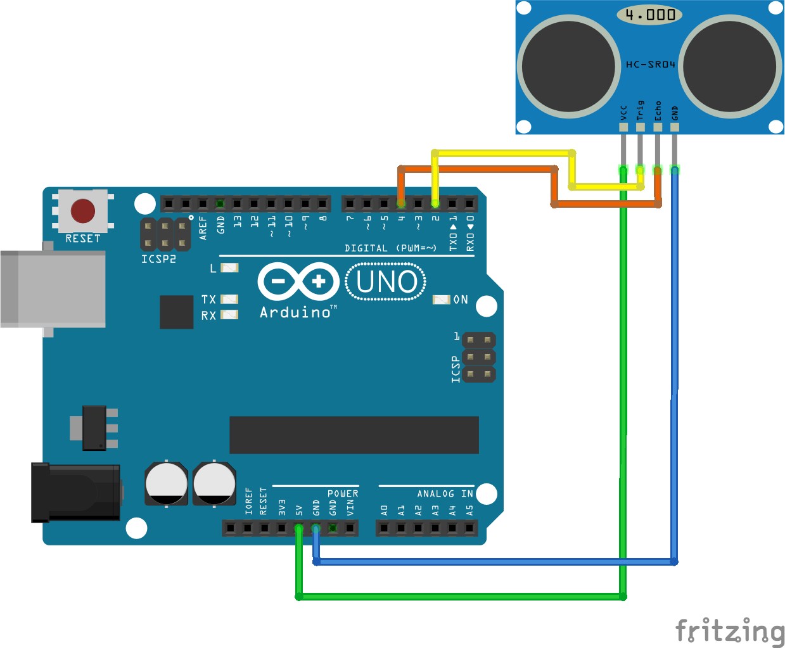

# WPSE477 Force sensing resistor sensor module

This example shows how to measure the output of the FSR (Force Sensing Resistor) module with an Arduino® compatible board.
The example program reads the analog signal output from the S-pin on the module and prints the result in the serial monitor.

## Library dependencies
* None

## Wiring diagram

## Additional information
  For more information about the Whadda WPSE477 force sensing resistor sensor module, check the manual available at [whadda.com](https://whadda.com)

